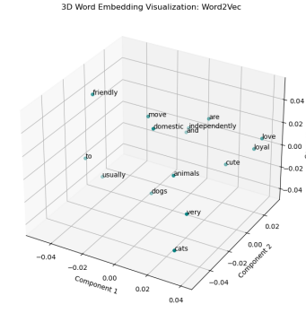
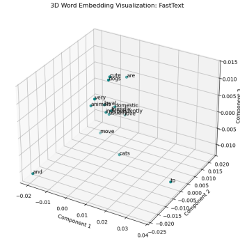

# NLP Word Embedding Comparison: Word2Vec vs. FastText 🛰️

This repository showcases the implementation and 3D visualization of word embeddings using two industry-standard models: **Word2Vec** (developed by Google) and **FastText** (developed by Meta/Facebook).

## 🧠 Concepts
Word embeddings are dense vector representations of words that capture semantic and syntactic relationships.
- **Word2Vec:** Learns vector representations by predicting words based on their context. It treats each word as an atomic entity.
- **FastText:** An extension of Word2Vec that treats each word as composed of character n-grams. This allows it to handle morphological richness and out-of-vocabulary words more effectively.

## 🖥️ 3D Visualizations
We used **PCA (Principal Component Analysis)** to reduce 50-dimensional word vectors into 3D space for intuitive visualization.

### 1. Word2Vec Visualization
The Word2Vec model clusters words based on their co-occurrence in the training sentences.

### 2. FastText Visualization
FastText captures subword information, which often leads to different clustering patterns, especially for morphologically similar words.

## 🛠️ Tech Stack
- `gensim`: For training Word2Vec and FastText models.
- `scikit-learn`: For **PCA** dimensionality reduction.
- `matplotlib`: For 3D scatter plotting.
- `pandas`: For data organization.

## 🚀 Key Features
- **Preprocessing:** Automated tokenization and cleaning using `simple_preprocess`.
- **Dimensionality Reduction:** Seamlessly converting high-dimensional embeddings to 3D.
- **Comparison:** Side-by-side visual analysis of how different algorithms map the same vocabulary.

## 💻 How to Run
1. Install requirements: `pip install gensim scikit-learn matplotlib pandas`
2. Run the script `word_embedding_comparison.py`.
3. The plots will appear in your IDE's **Plots** pane or as interactive windows depending on your backend settings.
